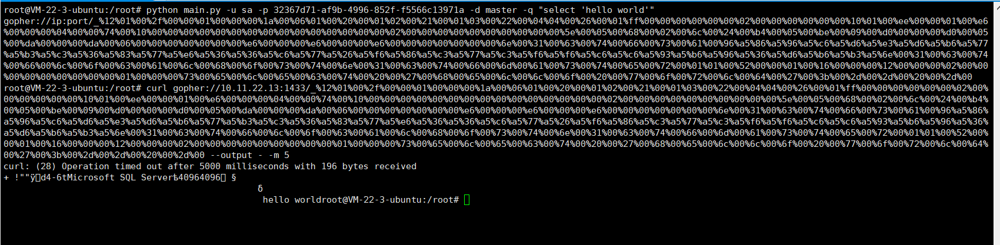

## Usage

usage:

```
usage: main.py [-h] --username USERNAME --password PASSWORD --database
               DATABASE --query QUERY

Attack SQL Server through gopher protocol

optional arguments:
  -h, --help            show this help message and exit
  --username USERNAME, -u USERNAME
                        mssql username
  --password PASSWORD, -p PASSWORD
                        mssql password
  --database DATABASE, -d DATABASE
                        mssql database name
  --query QUERY, -q QUERY
                        mssql sql query statement
```

E.g: 

```shell script
python main.py -u sa -p 32367d71-af9b-4996-852f-f5566c13971a -d master -q "select 'hello world'"
```

